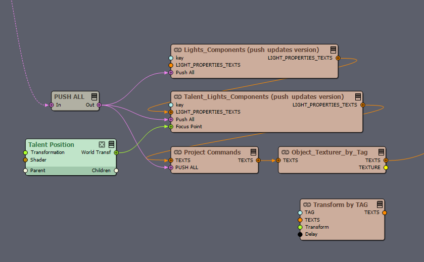
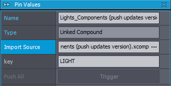
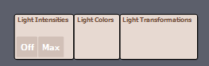
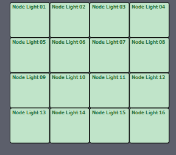

# aximmetry.unreal.utilities

### Overview of compounds

In the image we see

- General lights, which we identify by tag. If we put light as key, it will try to detect light1 - light16
- You can adjust intensity, color, and transformation
- Talent lights differ from the previous compound because it allows to change the relative position to the focus point (which can be anything)
- There is a compound to dynamically texture by tag (although it is limited as there is no way to load an image dynamically and use it as a texture, without an external plugin)
- Transform by Tag simply allows to dynamically transform an object by just tagging it in unreal. This is much easier and much more portable, than having to drag objects inside the level blueprint and do the tedious job with the Aximmetry get transformation function.
- The Project Commands, are custom command we define and handle then inside Unreal. The benefit is again portability. Just copy paste the compound you have created from one project to the other, with the same level blueprint and Blueprint Functions and you are done.
  Some commands i have is changing exposure, screenpercentage etc.

## The light compound

We set in the pin values the key which we want to use. For the LIGHT key, it will search for LIGHT1 to LIGHT16
We can duplicate the compound and use another key for more lights

The generated light control panel, lets you change the intensity, light color and transformations.
In the light transformation panel at the button, there is a switch if we like to push transformations or not.
By default its off, because it will mess with the existing transformations, since there is not way to read from unreal and initialize transformations.

The same things happen in the talent compound, but the transformations are relative to the current position of the light.
We also have light position nodes to help position in the scene.

## Project Commands

To use project commands, you have to design your own commands. Just open the compound and see how the commands are constructed.
Its pretty simple. My design in COMMAND_NAME arguments;COMMAND_NAME arguments and arguments are comma separated, but you can change that

One you create the command, you just have to handle it in Unreal (mimic the already existing commands)

## Benefit

The main benefit is portability. Copy from one project to the other and just works. You only need to set the tags to the objects you have to manipulate.

## Performance.

Since searching by tag in Unreal is time consuming, there is a reference table inside Unreal (like a cache). We first look there for the tag_name, if we do not find it, search for the tag, once, retrieve the actor and set it in the reference table, for future uses. So you only have to do it once.
